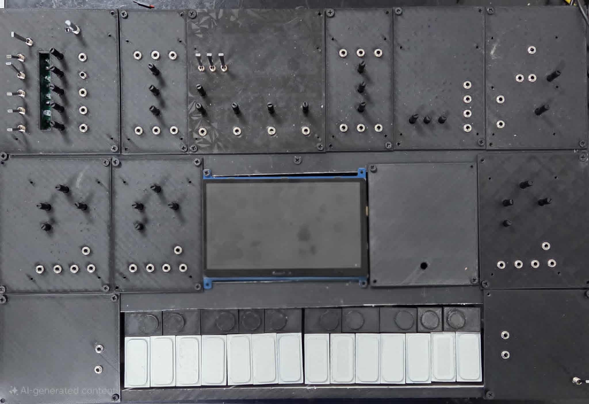

# Modular Synth Project 🎛️🎹

A fully custom **modular synthesizer** combining classic analog modules with a digital control surface for drums and keyboard scanning.  

---

## ✨ Features

### Analog Modules
- **3 × VCOs (Voltage Controlled Oscillators)**  
- **Analog Sequencer**  
- **VCA (Voltage Controlled Amplifier)**  
- **2 × Mixers**  
- **Analog Filter**  
- **Wavefolder**  
- **ADSR Envelope Generator**

### Digital Integration
- **ESP32 keyboard scanner**
  - Reads a physical keyboard matrix
  - Outputs 3 independent control voltages via DACs
  - Up to **3-note polyphony** (one per VCO)
- **Raspberry Pi touchscreen**
  - Acts as a **drumpad machine**
  - Includes **looper** for layering rhythms

## 📸 Synth Photo

---